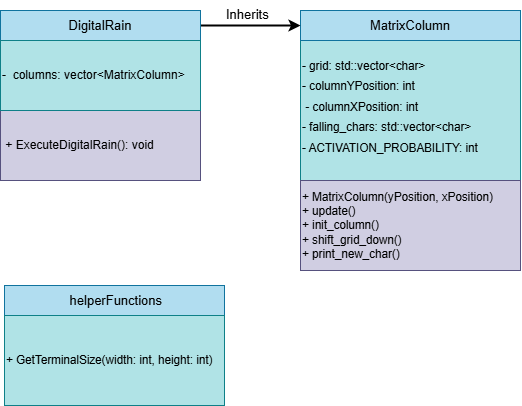

# Design and Test.

In this project, I was challenged to design a terminal printed "digital rain" in OOP programming style.
While undoubtably, it would be very much doable to write a one page script for this with the help of the internet.
Introducing the concepts of objects and inheritance pushed me to be more deliberate with how I went about programming.

## UML Diagram:

